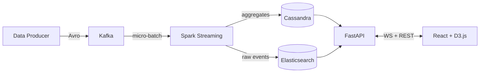

# Realtime Analytics Dashboard

A full-stack real-time analytics pipeline that ingests synthetic user events through Kafka, processes them with Spark Streaming, stores results in Cassandra and Elasticsearch, and displays live-updating charts in a React + D3.js dashboard. Built as a portfolio project demonstrating end-to-end data engineering and full-stack development.

## Architecture



> See [docs/ARCHITECTURE.md](docs/ARCHITECTURE.md) for detailed component descriptions.

## Tech Stack

| Layer          | Technology                    | Purpose                          |
|----------------|-------------------------------|----------------------------------|
| Ingestion      | Python, confluent-kafka       | Synthetic event generation       |
| Messaging      | Apache Kafka + Schema Registry| Event streaming with Avro schemas|
| Processing     | PySpark Structured Streaming  | Windowed aggregations            |
| Storage (OLAP) | Apache Cassandra              | Time-series aggregate queries    |
| Storage (Search)| Elasticsearch               | Full-text search, ad-hoc queries |
| Caching        | Redis                         | API response caching             |
| API            | FastAPI (REST + WebSocket)    | Data serving + real-time push    |
| Frontend       | React 18, D3.js, Vite        | Interactive live dashboard       |
| IaC            | Terraform                     | AWS free-tier provisioning       |
| CI/CD          | GitHub Actions                | Lint, test, deploy pipeline      |

## Run Locally

**Prerequisites:** Docker Desktop (with Docker Compose v2) and ~4 GB free RAM.

```bash
git clone https://github.com/YOUR_USERNAME/realtime-analytics.git
cd realtime-analytics
cp .env.example .env          # edit ports if you have conflicts
docker compose up -d           # pulls images and starts all services
docker compose ps              # verify all services are healthy
```

The init container automatically creates the Kafka topic (`analytics.events`),
Cassandra keyspace (`analytics`), and Elasticsearch index (`events`) on first boot.

**Service endpoints once healthy:**

| Service         | URL                          |
|-----------------|------------------------------|
| FastAPI          | http://localhost:8000/health |
| Spark Master UI  | http://localhost:8080        |
| Elasticsearch    | http://localhost:9200        |
| Kafka broker     | localhost:9092               |
| Cassandra CQL    | localhost:9042               |
| Redis            | localhost:6379               |

**Tear down:**

```bash
docker compose down            # stop containers, keep volumes
docker compose down -v         # stop containers and delete data volumes
```

## Live Demo

> **[Live Dashboard →](#)** *(link will be added after deployment)*

## Project Structure

```
realtime-analytics/
├── docker-compose.yml          # Full local stack
├── .env.example                # Environment variable template
├── docs/
│   ├── ARCHITECTURE.md         # System design + Mermaid diagrams
│   └── EVENT_SCHEMA.md         # Avro schema definitions
├── src/
│   ├── data_producer/          # Python Kafka producer
│   ├── spark_jobs/             # PySpark streaming jobs
│   ├── api/                    # FastAPI REST + WebSocket
│   └── cassandra/              # CQL schema + init scripts
├── frontend/                   # React + D3.js dashboard (Vite)
├── terraform/                  # AWS free-tier infra
└── .github/workflows/          # CI/CD pipelines
```

## License

MIT
