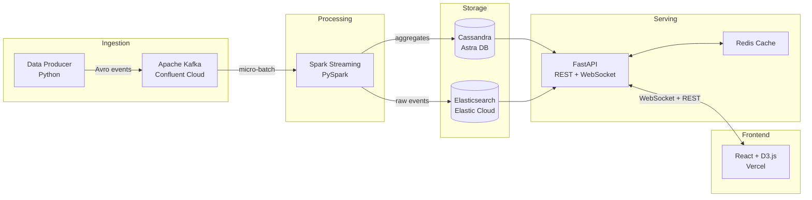

# Architecture

## System Overview

A real-time analytics pipeline that ingests events, processes them through stream processing, stores aggregates in purpose-built databases, and serves them via a live-updating dashboard.

## Architecture Diagram

## Component Descriptions

### Data Producer (`src/data_producer/`)

Python service that generates synthetic analytics events (page views, clicks, purchases) and publishes them to Kafka topics using Avro serialization. Configurable event rate and distribution.

- **Runtime:** Python 3.11
- **Key libraries:** confluent-kafka, fastavro
- **Output:** Avro-encoded events to Kafka topics

### Apache Kafka

Message broker that decouples event ingestion from processing. Uses a single topic with partitioning by event type for ordered processing within each category.

- **Local:** Confluent Platform via Docker Compose (broker + schema registry)
- **Cloud:** Confluent Cloud free tier (Basic cluster)
- **Topics:** `analytics.events` (partitioned by event type)

### Spark Streaming (`src/spark_jobs/`)

PySpark Structured Streaming job that consumes from Kafka, deserializes Avro events, computes windowed aggregations (1-min, 5-min, 1-hour), and writes results to Cassandra. Raw events are forwarded to Elasticsearch for full-text search.

- **Runtime:** PySpark 3.5 in Docker (local only, not EMR)
- **Processing:** Micro-batch with 10-second trigger interval
- **Output:** Aggregated metrics to Cassandra, raw events to Elasticsearch

### Cassandra (`src/cassandra/`)

Wide-column store optimized for time-series aggregate queries. Tables are modeled around dashboard query patterns (metrics by time window, top pages, conversion funnels).

- **Local:** Apache Cassandra 4.1 via Docker
- **Cloud:** DataStax Astra DB free tier
- **Schema:** Query-driven table design with TTL-based data expiration

### Elasticsearch

Full-text search and ad-hoc analytics on raw events. Used for the dashboard's search/filter functionality and drill-down queries that don't fit Cassandra's query patterns.

- **Local:** Elasticsearch 8.x via Docker
- **Cloud:** Elastic Cloud 14-day trial
- **Indices:** `events-YYYY.MM.DD` with ILM rollover

### FastAPI (`src/api/`)

REST API and WebSocket server. REST endpoints serve historical aggregates from Cassandra and search results from Elasticsearch. WebSocket pushes real-time metric updates to connected dashboard clients.

- **Runtime:** Python 3.11, FastAPI + Uvicorn
- **Caching:** Redis with 60-second TTL for aggregate queries
- **Auth:** API key (simple, portfolio-appropriate)
- **Deploy:** AWS EC2 free tier (t2.micro)

### React Dashboard (`frontend/`)

Single-page application with real-time charts. Built with Vite, React 18, and D3.js for custom visualizations. Connects to the API via REST for historical data and WebSocket for live updates.

- **Framework:** React 18 + Vite
- **Charts:** D3.js (custom SVG bindings)
- **State:** Zustand for global state, React Query for server state
- **Deploy:** Vercel free tier

### Infrastructure (`terraform/`)

Terraform configs for AWS free-tier resources only: EC2 instance (API server), security groups, and IAM roles. Cloud-managed services (Confluent, Astra, Elastic, Vercel) are provisioned manually via their free tiers.

## Data Flow

1. **Produce:** Data producer generates events at configurable rate → Kafka
2. **Process:** Spark reads Kafka micro-batches → computes aggregates → writes to Cassandra and Elasticsearch
3. **Serve:** FastAPI reads from Cassandra (aggregates) and Elasticsearch (search) → caches in Redis → serves via REST and WebSocket
4. **Display:** React dashboard fetches initial state via REST, subscribes to WebSocket for live updates, renders D3.js charts

## Local vs Cloud Deployment

| Component       | Local (Docker Compose)     | Cloud (Free Tier)         |
|-----------------|----------------------------|---------------------------|
| Kafka           | Confluent Platform         | Confluent Cloud Basic     |
| Spark           | PySpark in Docker          | PySpark in Docker (same)  |
| Cassandra       | Cassandra 4.1              | DataStax Astra DB         |
| Elasticsearch   | Elasticsearch 8.x          | Elastic Cloud trial       |
| Redis           | Redis 7                    | ElastiCache (or embedded) |
| API             | Uvicorn (localhost)        | AWS EC2 t2.micro          |
| Frontend        | Vite dev server            | Vercel                    |
